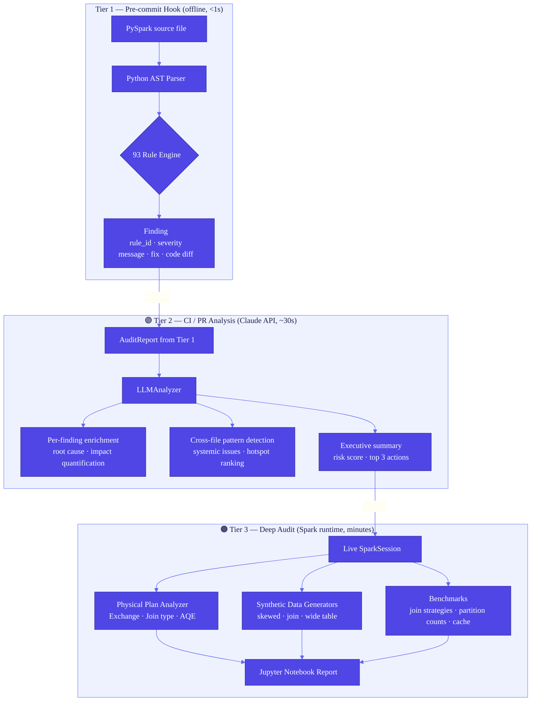

# ⚡ spark-perf-lint

[](https://github.com/sunilpradhansharma/spark-perf-lint/actions/workflows/ci.yml)
[](https://www.python.org/downloads/)
[](docs/RULES_REFERENCE.md)
[](docs/RULES_REFERENCE.md)
[](https://www.linkedin.com/in/sunil-p-sharma/)
[](https://pre-commit.com)
[](https://github.com/psf/black)

> **Enterprise-grade Apache Spark performance linter** — catches anti-patterns before they reach production, explains *why* they hurt, and hands you a concrete fix.

---

## What This Tool Is

`spark-perf-lint` is a static analysis linter for PySpark code that catches performance anti-patterns at the earliest possible moment — in your editor, at commit time, and in CI — long before a job runs on hundreds of millions of records and costs you hours of cluster time and thousands of dollars. Unlike generic Python linters, every finding is Spark-aware: it knows the difference between a `groupByKey` that serialises all values to the driver and a `reduceByKey` that aggregates map-side, and it tells you *exactly* how much that difference costs.

The tool operates across **three tiers**: Tier 1 is a pure-Python AST scanner (zero Spark dependency) that runs in milliseconds as a pre-commit hook; Tier 2 adds optional Claude LLM enrichment in CI for cross-file pattern detection and root-cause analysis; Tier 3 provides a Jupyter-based deep audit against a live Spark runtime with physical plan inspection and synthetic benchmark datasets. Each finding carries a six-layer structure — what was found, why it hurts (referencing Spark internals), a concrete fix, before/after code, quantified impact, and remediation effort — so engineers never have to look anything up.

---

## Quick Start

### a. Pre-commit hook (catches issues before every commit)

```bash
pip install spark-perf-lint
```

Add to `.pre-commit-config.yaml`:

```yaml
repos:
  - repo: https://github.com/sunilpradhansharma/spark-perf-lint
    rev: v0.1.0
    hooks:
      - id: spark-perf-lint
        args: [--severity-threshold, WARNING, --fail-on, CRITICAL]
```

```bash
pre-commit install
pre-commit run spark-perf-lint --all-files
```

### b. CLI (scan any path interactively)

```bash
pip install spark-perf-lint

# Scan a directory
spark-perf-lint scan src/jobs/

# Scan with Tier 2 LLM enrichment (requires ANTHROPIC_API_KEY)
pip install "spark-perf-lint[llm]"
spark-perf-lint scan src/ --llm --severity-threshold WARNING

# List all 93 rules
spark-perf-lint rules

# Explain a specific rule
spark-perf-lint explain SPL-D03-001

# Generate an HTML trace report from previous runs
spark-perf-lint traces --dir .spark-perf-lint-traces --output report.html --open
```

### c. CI / GitHub Actions (annotates PRs inline)

```yaml
# .github/workflows/spark-lint.yml
name: Spark Performance Lint

on: [pull_request]

permissions:
  contents: read
  pull-requests: write

jobs:
  lint:
    runs-on: ubuntu-latest
    steps:
      - uses: actions/checkout@v4
      - uses: ./.github/actions/spark-perf-lint
        env:
          GITHUB_TOKEN: ${{ secrets.GITHUB_TOKEN }}
          ANTHROPIC_API_KEY: ${{ secrets.ANTHROPIC_API_KEY }}   # optional Tier 2
        with:
          severity: WARNING
          fail_on: CRITICAL
          llm_enabled: "true"
```

---

## Who This Is For

| Role | Pain Point Solved | Key Dimensions |
|---|---|---|
| **Data Engineer** | Catches shuffle bombs, cartesian joins, and CSV anti-patterns before code review | D02 Shuffle · D03 Joins · D07 I/O |
| **Tech Lead / Code Reviewer** | Automated, consistent review commentary with before/after code diffs on every PR | All 11 dimensions |
| **Platform / Infrastructure Team** | Enforces org-wide Spark config standards via `spark_config_audit` YAML; tracks trends via HTML trace reports | D01 Cluster · D08 AQE |
| **Performance Engineer** | Tier 3 deep audit with physical plan analysis, partition histograms, and A/B benchmark helpers | All tiers |
| **Interview / Learning** | 93 documented anti-patterns with Spark-internal explanations — a structured study guide | All dimensions |

---

## Example Output

```
╔══════════════════════════════════════════════════════════════════╗
║  spark-perf-lint · Tier 1 Static Analysis · v0.1.0            ║
╚══════════════════════════════════════════════════════════════════╝
  Scanning 3 files …

  ● SPL-D03-001  CRITICAL  jobs/etl_pipeline.py:47
    Cartesian product (cross join) detected — no join key specified.
    WHY: Produces O(n × m) output rows. On 1M × 1M tables that is 10¹²
         rows materialised to disk, exhausting executor storage.
    FIX: Add an explicit join key or use a broadcast hint for small tables.

    Before │ orders_df.join(customers_df)
    After  │ orders_df.join(customers_df, on="customer_id", how="left")

    Impact: 10–10,000× slowdown · Effort: minor code change

  ● SPL-D08-001  CRITICAL  jobs/etl_pipeline.py:12
    spark.sql.adaptive.enabled not set — AQE is disabled.
    WHY: Without AQE, Spark cannot coalesce post-shuffle partitions, convert
         sort-merge joins to broadcast joins at runtime, or detect skewed tasks.
    FIX: .config("spark.sql.adaptive.enabled", "true")

    Impact: up to 80% shuffle reduction on skewed data · Effort: config only

  ● SPL-D02-002  WARNING  jobs/etl_pipeline.py:83
    groupByKey() serialises all values for a key to a single executor before
    aggregation — causes OOM and excessive GC on high-cardinality keys.

    Before │ rdd.groupByKey().mapValues(sum)
    After  │ rdd.reduceByKey(lambda a, b: a + b)

    Impact: 3–10× slower; OOM risk on skewed keys · Effort: minor code change

  ● SPL-D04-006  WARNING  jobs/daily_positions.py:29
    coalesce(1) forces all data through a single partition — serialises
    100M+ rows to one executor and produces an unparallelisable write.

    Before │ df.coalesce(1).write.parquet(output_path)
    After  │ df.write.mode("overwrite").parquet(output_path)

  ◉ SPL-D06-002  INFO  jobs/daily_positions.py:61
    DataFrame cached but referenced only once — cache() adds memory pressure
    with no reuse benefit. Remove the cache() call.

──────────────────────────────────────────────────────────────────
  2 CRITICAL  ·  2 WARNING  ·  1 INFO  ·  3 files  ·  0.31s
  Status: FAIL  — fix CRITICAL findings before merging.
──────────────────────────────────────────────────────────────────
```

---

## Three-Tier Architecture



<details>
<summary>ASCII fallback for environments without Mermaid rendering</summary>

```
┌─────────────────────────────────────────────────────────────────┐
│  TIER 1: Pre-commit  (pure Python AST · zero Spark dep · <1s)  │
│                                                                   │
│  .py source ──► AST Parser ──► 93 Rule Engine ──► Findings      │
│                                    ↓                              │
│                    Finding: rule_id · severity · message          │
│                             before/after code · impact            │
└─────────────────────────────────────────────────────────────────┘
                            │ AuditReport
                            ▼
┌─────────────────────────────────────────────────────────────────┐
│  TIER 2: CI/PR  (Claude API · optional · ~30s)                  │
│                                                                   │
│  AuditReport ──► LLMAnalyzer ──► per-finding root-cause         │
│                             └──► cross-file pattern detection    │
│                             └──► executive summary + risk score  │
└─────────────────────────────────────────────────────────────────┘
                            │ insights
                            ▼
┌─────────────────────────────────────────────────────────────────┐
│  TIER 3: Deep Audit  (Spark runtime · Jupyter · minutes)        │
│                                                                   │
│  SparkSession ──► Physical Plan Analyzer (Exchange, Join type)  │
│              └──► Synthetic Data Generators (skew, join, wide)  │
│              └──► Benchmarks (join strategies, partition counts) │
└─────────────────────────────────────────────────────────────────┘
```
</details>

### Tier Comparison

| | Tier 1 | Tier 2 | Tier 3 |
|---|---|---|---|
| **Trigger** | Pre-commit / `scan` CLI | CI pull request | Manual / scheduled |
| **Speed** | < 1 second | 15–60 seconds | Minutes |
| **Spark required** | No | No | Yes |
| **Cost** | Free | Claude API tokens | Cluster compute |
| **Detection** | Structural anti-patterns | Root cause + cross-file patterns | Runtime skew, physical plan |
| **Output** | Terminal / JSON / Markdown | Enriched findings + executive summary | Jupyter notebook + HTML |

---

## The 11 Dimensions — 93 Rules at a Glance

| # | Dimension | Rules | Focus | Key Anti-Patterns Caught |
|---|---|:---:|---|---|
| D01 | **Cluster Configuration** | 8 | Executor/driver sizing, serialisation | Under-provisioned memory, missing Kryo, hardcoded master URL |
| D02 | **Shuffle** | 9 | Data movement across executors | `groupByKey`, default 200 partitions, pre-write `repartition` |
| D03 | **Joins** | 9 | Join strategy selection | Cartesian products, missing broadcast hints, skewed joins without salting |
| D04 | **Partitioning** | 9 | Task parallelism and file sizing | `coalesce(1)`, unbounded repartition, write without `partitionBy` |
| D05 | **Data Skew** | 9 | Hot-key distribution | Null-key joins, low-cardinality `groupBy`, unbounded window functions |
| D06 | **Caching** | 9 | Persist/unpersist lifecycle | Leaked cache, single-use cache, `DISK_ONLY` anti-pattern |
| D07 | **I/O Format** | 10 | Storage efficiency | CSV/JSON writes, `inferSchema`, missing predicate pushdown |
| D08 | **AQE** | 7 | Spark 3 adaptive execution | AQE disabled, skew-join handler off, partition coalescing disabled |
| D09 | **UDF Code Quality** | 12 | Python UDF performance | Row-at-a-time UDFs, missing return types, UDF in loop, lambda UDFs |
| D10 | **Catalyst Optimizer** | 6 | Logical plan efficiency | `select("*")`, late filter, `withColumn` loop, `explode` without filter |
| D11 | **Monitoring & Observability** | 5 | Production operability | No event log, silent action failures, missing logging framework |
| | **Total** | **93** | | |

Full rule documentation: [`docs/RULES_REFERENCE.md`](docs/RULES_REFERENCE.md)  
List in terminal: `spark-perf-lint rules --format table`  
Deep-dive on one rule: `spark-perf-lint explain SPL-D03-001`

---

## How the Linter Thinks

Every rule emits a `Finding` with a six-layer structure. Here is a real example from rule `SPL-D09-001`:

```python
Finding(
    # ── Layer 1: Identity ──────────────────────────────────────
    rule_id    = "SPL-D09-001",
    severity   = Severity.WARNING,
    dimension  = Dimension.D09_UDF_CODE,
    file_path  = "jobs/scoring_pipeline.py",
    line_number= 34,

    # ── Layer 2: What was found ────────────────────────────────
    message    = "Python UDF used where a pandas (vectorised) UDF could be used",

    # ── Layer 3: Why it hurts (Spark internals) ────────────────
    explanation= (
        "Row-at-a-time Python UDFs cross the JVM/Python boundary once per "
        "row via Py4J. On 100M rows this produces 100M serialise/deserialise "
        "round-trips. A pandas UDF batches rows into Arrow buffers, crossing "
        "the boundary once per partition — typically 3–10× faster."
    ),

    # ── Layer 4: Actionable fix ────────────────────────────────
    recommendation = (
        "Replace @udf with @pandas_udf and accept/return pandas.Series. "
        "Ensure spark.sql.execution.arrow.pyspark.enabled = true."
    ),

    # ── Layer 5: Before / After ────────────────────────────────
    before_code = "@udf(returnType=DoubleType())\ndef score(x): return x * 1.5",
    after_code  = (
        "@pandas_udf(DoubleType())\n"
        "def score(x: pd.Series) -> pd.Series: return x * 1.5"
    ),

    # ── Layer 6: Effort and quantified impact ──────────────────
    estimated_impact = "3–10× throughput improvement on vectorisable UDFs",
    effort_level     = EffortLevel.MINOR_CODE_CHANGE,
    config_suggestion= {"spark.sql.execution.arrow.pyspark.enabled": "true"},
)
```

When Tier 2 LLM analysis is enabled, each qualifying finding also receives an `llm_insight` field with context-aware root-cause analysis, caveats specific to your codebase patterns, and a cross-file systemic diagnosis.

---

## Decision Guides

### Join Strategy Selection

```
Is the smaller table < broadcast_threshold_mb (default 10 MB)?
│
├─ YES ──► Use F.broadcast(small_df).join(large_df, ...)
│          Rule: SPL-D03-002 fires if broadcast hint is missing
│
└─ NO  ──► Is spark.sql.adaptive.enabled = true?
           │
           ├─ YES ──► Let AQE decide at runtime (SortMergeJoin → BHJ)
           │          Ensure SPL-D08-001 does not fire
           │
           └─ NO  ──► Is the join key skewed?
                      │
                      ├─ YES ──► Salt the key (see SPL-D03-006)
                      │          key_salted = F.concat(key, (F.rand()*N).cast("int"))
                      │
                      └─ NO  ──► Proceed with SortMergeJoin
                                 Check SPL-D02-001 (shuffle partitions)
```

### Cache Decision

```
Will this DataFrame be used more than once?
│
├─ NO  ──► Do NOT cache (SPL-D06-002 fires)
│
└─ YES ──► Does it fit in executor memory?
           │
           ├─ YES ──► df.cache()  or  df.persist(MEMORY_ONLY)
           │
           └─ NO  ──► df.persist(MEMORY_AND_DISK)
                      Or write to Parquet and re-read (SPL-D06-006)
                      Always call df.unpersist() when done (SPL-D06-001)
```

### Partition Count Formula

```
Target partition count  =  max(
    default_parallelism,                     # executor cores × instances
    ceil(dataset_size_bytes / 128_MB),       # target_partition_size_mb
    ceil(total_shuffle_bytes / 200_MB)       # post-shuffle target
)

Rule SPL-D04-001 fires when count > max_partition_count (default 10,000)
Rule SPL-D04-002 fires when count < min_partition_count (default 2)
Rule SPL-D02-001 fires when spark.sql.shuffle.partitions = 200 (default)
```

---

## Configuration

### Key Options (`.spark-perf-lint.yaml`)

```yaml
general:
  severity_threshold: WARNING   # INFO | WARNING | CRITICAL
  fail_on: [CRITICAL]           # exit non-zero on these severities
  report_format: [terminal]     # terminal | json | markdown | github_pr
  max_findings: 0               # 0 = unlimited

thresholds:
  broadcast_threshold_mb: 10    # table size below which broadcast is safe
  max_shuffle_partitions: 2000  # upper bound before flagging over-partitioning
  min_shuffle_partitions: 10    # lower bound
  skew_ratio_warning: 5.0       # max/median partition rows that triggers WARNING
  skew_ratio_critical: 10.0     # max/median that triggers CRITICAL

severity_override:
  SPL-D03-001: CRITICAL         # promote/demote any rule
  SPL-D07-007: INFO

ignore:
  files: ["**/*_test.py", "**/conftest.py"]
  rules: [SPL-D11-001]          # suppress globally
  directories: [".venv", "notebooks"]

llm:
  enabled: false                # true enables Tier 2 (requires anthropic pkg)
  model: claude-sonnet-4-6      # or claude-opus-4-6 for deeper analysis
  max_llm_calls: 20             # cost control
  min_severity_for_llm: WARNING

observability:
  enabled: false                # true writes spl-trace-*.json per run
  backend: file                 # file | langsmith
  output_dir: .spark-perf-lint-traces
  trace_level: standard         # minimal | standard | verbose
```

### Preset Modes

<details>
<summary><b>strict</b> — for mature codebases enforcing zero technical debt</summary>

```yaml
# .spark-perf-lint.yaml  (strict mode)
general:
  severity_threshold: INFO
  fail_on: [WARNING, CRITICAL]
  max_findings: 0

spark_config_audit:
  enabled: true

observability:
  enabled: true
  trace_level: verbose
```
</details>

<details>
<summary><b>gradual</b> — for migrating an existing codebase incrementally</summary>

```yaml
# .spark-perf-lint.yaml  (gradual mode — block only the worst)
general:
  severity_threshold: WARNING
  fail_on: [CRITICAL]
  max_findings: 20              # cap noise on large legacy codebases

severity_override:
  SPL-D11-001: INFO             # monitoring is aspirational for now
  SPL-D11-002: INFO
  SPL-D01-005: INFO             # relax parallelism default check

ignore:
  directories: [legacy/, migrations/]
```
</details>

<details>
<summary><b>ci-only</b> — lightweight check for CI with GitHub PR annotations</summary>

```yaml
# .spark-perf-lint.yaml  (ci-only mode)
general:
  severity_threshold: WARNING
  fail_on: [CRITICAL]
  report_format: [github_pr]

llm:
  enabled: true
  model: claude-haiku-4-5-20251001   # faster + cheaper for CI
  max_llm_calls: 10

observability:
  enabled: true
  backend: file
  trace_level: minimal
```
</details>

---

## Pre-commit Integration

Full `.pre-commit-config.yaml` with `ruff`, `mypy`, and `spark-perf-lint`:

```yaml
# .pre-commit-config.yaml
repos:
  # ── Standard hooks ────────────────────────────────────────────────
  - repo: https://github.com/pre-commit/pre-commit-hooks
    rev: v4.6.0
    hooks:
      - id: trailing-whitespace
      - id: end-of-file-fixer
      - id: check-yaml
      - id: check-added-large-files
        args: [--maxkb=1024]
      - id: check-merge-conflict
      - id: detect-private-key

  # ── Python formatting ──────────────────────────────────────────────
  - repo: https://github.com/psf/black
    rev: 24.4.2
    hooks:
      - id: black
        language_version: python3
        args: [--line-length=100]

  # ── Python linting ─────────────────────────────────────────────────
  - repo: https://github.com/astral-sh/ruff-pre-commit
    rev: v0.4.4
    hooks:
      - id: ruff
        args: [--fix, --exit-non-zero-on-fix]

  # ── Type checking ──────────────────────────────────────────────────
  - repo: https://github.com/pre-commit/mirrors-mypy
    rev: v1.9.0
    hooks:
      - id: mypy
        additional_dependencies: [pyyaml, types-PyYAML]
        args: [--ignore-missing-imports]

  # ── Spark performance linting ──────────────────────────────────────
  - repo: https://github.com/sunilpradhansharma/spark-perf-lint
    rev: v0.1.0
    hooks:
      - id: spark-perf-lint
        name: spark-perf-lint (Spark performance analysis)
        language: python
        types: [python]
        args:
          - --severity-threshold
          - WARNING
          - --fail-on
          - CRITICAL
          # Uncomment to also fail on warnings:
          # - --fail-on
          # - WARNING
          # Uncomment to restrict to specific dimensions:
          # - --dimension
          # - D03,D08
```

**Bypassing in emergencies** (use sparingly — document the reason):

```bash
# Skip just spark-perf-lint
SKIP=spark-perf-lint git commit -m "hotfix: ..."

# Skip all hooks (requires explicit --no-verify)
git commit --no-verify -m "hotfix: ..."
```

---

## CI/CD Integration

Complete GitHub Actions workflow with optional Tier 2 LLM analysis:

```yaml
# .github/workflows/spark-lint.yml
name: Spark Performance Lint

on:
  pull_request:
    paths:
      - "**.py"
      - ".spark-perf-lint.yaml"

permissions:
  contents: read
  pull-requests: write       # required to post review comments

jobs:
  spark-perf-lint:
    name: Spark Performance Lint
    runs-on: ubuntu-latest

    steps:
      - name: Checkout
        uses: actions/checkout@v4

      - name: Spark Performance Lint
        id: lint
        uses: ./.github/actions/spark-perf-lint
        env:
          GITHUB_TOKEN: ${{ secrets.GITHUB_TOKEN }}
          ANTHROPIC_API_KEY: ${{ secrets.ANTHROPIC_API_KEY }}   # optional
        with:
          severity: WARNING
          fail_on: CRITICAL
          llm_enabled: "true"   # omit ANTHROPIC_API_KEY to skip silently

      # Optional: surface counts as a workflow summary annotation
      - name: Annotate results
        if: always()
        run: |
          echo "### Spark Lint Results" >> $GITHUB_STEP_SUMMARY
          echo "| Metric | Value |" >> $GITHUB_STEP_SUMMARY
          echo "|---|---|" >> $GITHUB_STEP_SUMMARY
          echo "| Findings | ${{ steps.lint.outputs.findings-count }} |" >> $GITHUB_STEP_SUMMARY
          echo "| Critical | ${{ steps.lint.outputs.critical-count }} |" >> $GITHUB_STEP_SUMMARY
          echo "| Passed | ${{ steps.lint.outputs.passed }} |" >> $GITHUB_STEP_SUMMARY
```

**Action outputs** available to downstream steps:

| Output | Type | Description |
|---|---|---|
| `findings-count` | `int` | Total findings at or above `severity` threshold |
| `critical-count` | `int` | CRITICAL severity finding count |
| `passed` | `"true"/"false"` | `true` when no findings match `fail_on` severities |

---

## Fintech Use Cases

| Scenario | Data Volume | Relevant Rules | Avoided Outcome |
|---|---|---|---|
| **Daily position reconciliation** | 200M rows · 3-way join | SPL-D03-001, D03-006, D05-003 | Cartesian explosion → 8h+ job |
| **Real-time fraud scoring** | 50K events/s · UDF pipeline | SPL-D09-001, D09-003, D09-006 | Row-at-a-time UDF → 30s SLA breach |
| **End-of-day settlement** | 500M trade records · groupBy | SPL-D02-002, D05-001, D08-001 | groupByKey OOM → executor eviction |
| **Customer 360 aggregation** | 1B events · 40-column write | SPL-D04-004, D04-006, D07-002 | coalesce(1) bottleneck → 6h write |
| **Regulatory capital reporting** | 300M positions · complex plan | SPL-D08-001, D10-005, D10-004 | AQE off + withColumn loop → plan explosion |
| **Market data normalisation** | 2TB intraday CSV | SPL-D07-001, D07-002, D07-006 | inferSchema full scan + CSV write overhead |

---

## Repository Structure

```
spark-perf-lint/
│
├── src/spark_perf_lint/
│   ├── cli.py                      # Click CLI (scan · rules · init · explain · traces)
│   ├── config.py                   # 4-layer config stack (defaults → YAML → env → CLI)
│   ├── types.py                    # Finding · AuditReport · Severity · Dimension
│   │
│   ├── engine/
│   │   ├── ast_analyzer.py         # Python AST visitor (no Spark dep)
│   │   ├── pattern_matcher.py      # Rule matching framework
│   │   ├── file_scanner.py         # Recursive file discovery
│   │   ├── orchestrator.py         # Scan orchestration + tracer wiring
│   │   └── plan_analyzer.py        # Spark physical plan parser (Tier 3)
│   │
│   ├── rules/                      # 93 rules across 11 dimensions
│   │   ├── base.py                 # BaseRule ABC
│   │   ├── registry.py             # Rule auto-discovery
│   │   ├── d01_cluster_config.py   # 8 rules
│   │   ├── d02_shuffle.py          # 9 rules
│   │   ├── d03_joins.py            # 9 rules
│   │   ├── d04_partitioning.py     # 9 rules
│   │   ├── d05_skew.py             # 9 rules
│   │   ├── d06_caching.py          # 9 rules
│   │   ├── d07_io_format.py        # 10 rules
│   │   ├── d08_aqe.py              # 7 rules
│   │   ├── d09_udf_code.py         # 12 rules
│   │   ├── d10_catalyst.py         # 6 rules
│   │   └── d11_monitoring.py       # 5 rules
│   │
│   ├── reporters/
│   │   ├── terminal.py             # Rich-formatted terminal output
│   │   ├── json_reporter.py        # Machine-readable JSON
│   │   ├── markdown_reporter.py    # GitHub-compatible Markdown
│   │   └── github_pr.py            # Inline PR annotations + review comment
│   │
│   ├── llm/                        # Tier 2 — Claude API (optional)
│   │   ├── provider.py             # LLMProvider ABC + ClaudeLLMProvider
│   │   ├── prompts.py              # Prompt templates (finding · cross-file · summary)
│   │   └── analyzer.py             # LLMAnalyzer orchestrator
│   │
│   ├── observability/              # Run tracing + HTML report
│   │   ├── tracer.py               # BaseTracer · NullTracer · TracerFactory
│   │   ├── file_tracer.py          # JSON file-based tracer (default)
│   │   ├── langsmith_tracer.py     # LangSmith stub (future)
│   │   └── viewer.py               # Static HTML report generator
│   │
│   └── tier3/                      # Deep audit (requires Spark)
│       ├── data_generators.py      # 6 synthetic DataFrame generators
│       └── benchmarks.py           # Join · partition · cache benchmarks
│
├── tests/                          # pytest suite (unit + integration)
├── notebooks/deep_audit.ipynb      # Tier 3 interactive analysis
├── .github/
│   ├── workflows/ci.yml
│   ├── workflows/release.yml
│   └── actions/spark-perf-lint/action.yml   # Reusable composite action
├── .spark-perf-lint.yaml           # Reference configuration (all options documented)
├── docs/
│   ├── RULES_REFERENCE.md          # All 93 rules with examples
│   ├── CONFIGURATION.md
│   ├── PRE_COMMIT_SETUP.md
│   └── CONTRIBUTING.md
└── pyproject.toml
```

---

## Comparison with Existing Tools

| | **spark-perf-lint** | pylint / flake8 | Palantir `spark-style-guide` | sparkMeasure |
|---|---|---|---|---|
| **Spark-aware rules** | ✅ 93 Spark-specific | ❌ Generic Python | ⚠️ Style guide docs only | ❌ Metrics, not rules |
| **Before/after code fix** | ✅ Every finding | ❌ | ❌ | ❌ |
| **Pre-commit hook** | ✅ Built-in | ✅ | ❌ | ❌ |
| **CI PR annotations** | ✅ Inline diff comments | ⚠️ Via plugins | ❌ | ❌ |
| **LLM enrichment** | ✅ Claude (Tier 2) | ❌ | ❌ | ❌ |
| **Physical plan analysis** | ✅ Tier 3 | ❌ | ❌ | ✅ (metrics only) |
| **Zero Spark dependency** | ✅ Tier 1 | ✅ | ✅ | ❌ |
| **Config audit** | ✅ 75 Spark configs | ❌ | ❌ | ❌ |
| **Severity + effort levels** | ✅ | ⚠️ | ❌ | ❌ |
| **Structured findings** | ✅ JSON / Markdown | ⚠️ | ❌ | ⚠️ |
| **Observability / tracing** | ✅ HTML trace report | ❌ | ❌ | ⚠️ |

> **Note on Palantir:** The [Palantir Spark Style Guide](https://github.com/palantir/spark-style-guide) is an excellent reference document — `spark-perf-lint` encodes those recommendations as executable rules that catch violations automatically.

---

## Roadmap

### v0.1.0 — Current Release

- [x] 93 rules across 11 dimensions (D01–D11)
- [x] Pure-Python AST scanner (zero Spark dependency)
- [x] 4-layer configuration stack (defaults → YAML → env → CLI)
- [x] Terminal, JSON, Markdown, and GitHub PR reporters
- [x] Pre-commit hook integration
- [x] Reusable GitHub composite action
- [x] Tier 2 Claude LLM enrichment (per-finding + cross-file + executive summary)
- [x] Observability layer: file tracer + HTML trend report
- [x] Tier 3: physical plan analyzer, synthetic data generators, benchmarks
- [x] Deep audit Jupyter notebook

### v0.2.0 — Next (Q3 2026)

- [ ] `spark-perf-lint fix` — automated one-click remediation for safe rules
- [ ] LangSmith tracing backend (complete stub → production)
- [ ] VS Code extension with inline diagnostics
- [ ] Delta Lake dimension (D12): Z-ORDER, OPTIMIZE, VACUUM, time-travel anti-patterns
- [ ] Streaming dimension (D13): watermark missing, stateful op without checkpoint
- [ ] `spark-perf-lint rules --format html` — self-hosted rule catalogue site
- [ ] Per-file suppression comments (`# noqa: SPL-D03-001`)
- [ ] Severity trend alerting via GitHub Issues

### v0.3.0 — Future (Q4 2026)

- [ ] Spark Connect / Databricks Connect support
- [ ] Cost estimation: map findings to approximate cluster-hour savings
- [ ] Team leaderboard: track finding density per engineer over time
- [ ] SQL dialect support (Spark SQL `.sql()` calls in Python strings)
- [ ] Integration with Databricks Asset Bundles CI pipeline

---

## Contributing

Contributions are welcome — whether that is a new rule, a bug fix, an improvement to an existing explanation, or a documentation clarification. Please read [`docs/CONTRIBUTING.md`](docs/CONTRIBUTING.md) before opening a PR. In short: every new rule must have at least one positive test case (the rule fires) and one negative test case (the rule does not fire), and the finding must include a non-generic `recommendation` with before/after code. Run `pytest` and `pre-commit run --all-files` before submitting.

---

## References

- [Apache Spark Documentation — Performance Tuning](https://spark.apache.org/docs/latest/sql-performance-tuning.html)
- [Apache Spark Documentation — Adaptive Query Execution](https://spark.apache.org/docs/latest/sql-performance-tuning.html#adaptive-query-execution)
- [Palantir Spark Style Guide](https://github.com/palantir/spark-style-guide) — foundational style reference encoded as rules
- [Cluster Yield Blog — Spark Shuffle Internals](https://www.databricks.com/blog/2015/06/22/understanding-your-spark-application-through-visualization.html)
- [*Spark: The Definitive Guide* — Chambers & Zaharia (O'Reilly, 2018)](https://www.oreilly.com/library/view/spark-the-definitive/9781491912201/)
- [*Learning Spark, 2nd Edition* — Damji et al. (O'Reilly, 2020)](https://www.oreilly.com/library/view/learning-spark-2nd/9781492050032/)
- [Databricks — Best Practices for AQE](https://www.databricks.com/blog/2020/05/29/adaptive-query-execution-speeding-up-spark-sql-at-runtime.html)
- [High Performance Spark — Karau & Warren (O'Reilly, 2017)](https://www.oreilly.com/library/view/high-performance-spark/9781491943199/)

---

## License

Free to use for any purpose including commercial. Credit to Sunil Pradhan Sharma required. See LICENSE.

---

<p align="center">
  Built with ♥ for the Spark community ·
  <a href="https://github.com/sunilpradhansharma/spark-perf-lint/issues">Report an issue</a> ·
  <a href="https://github.com/sunilpradhansharma/spark-perf-lint/discussions">Discussions</a>
</p>
